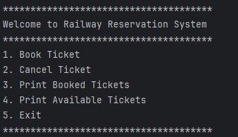
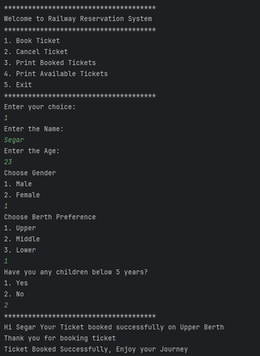
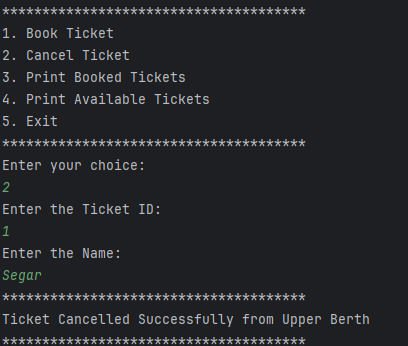
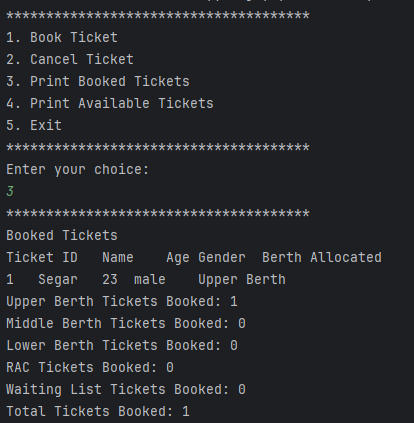
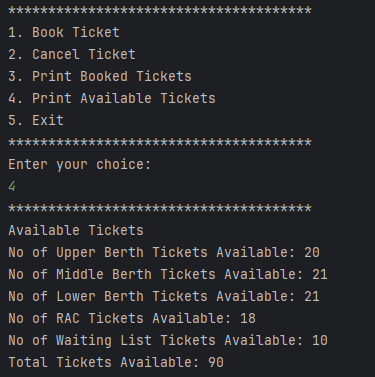

# Railway Reservation System using Java and OOPS

<!-- TOC -->
* [Railway Reservation System using Java and OOPS](#railway-reservation-system-using-java-and-oops)
    * [Main Menu:](#main-menu)
    * [Book Ticket Module:](#book-ticket-module)
    * [Cancel Ticket Module:](#cancel-ticket-module)
    * [Print Booked Tickets Module:](#print-booked-tickets-module)
    * [Print Available Tickets Module:](#print-available-tickets-module)
    * [Author - Chandirasegaran](#author---chandirasegaran)
<!-- TOC -->

---

### Main Menu:

---
### Book Ticket Module:

---

### Cancel Ticket Module:

---

### Print Booked Tickets Module:

---

### Print Available Tickets Module:

---

### Author - [Chandirasegaran](https://github.com/Chandirasegaran)

---